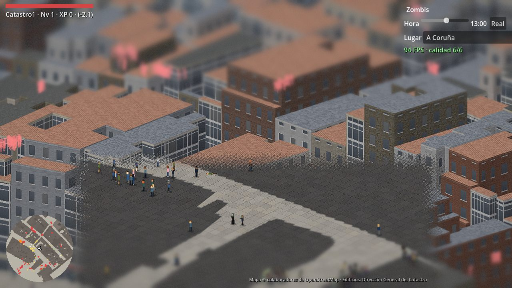
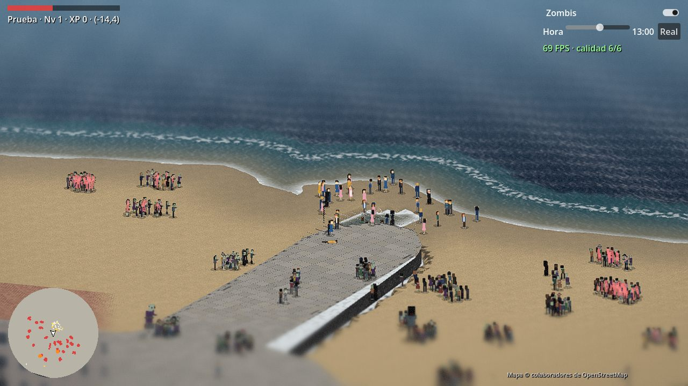
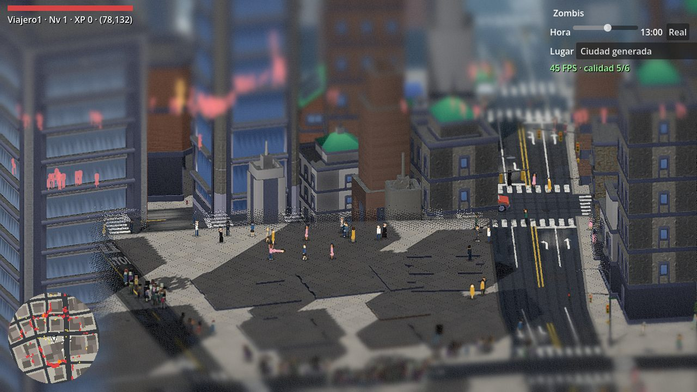
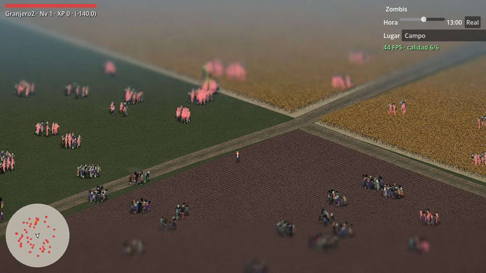
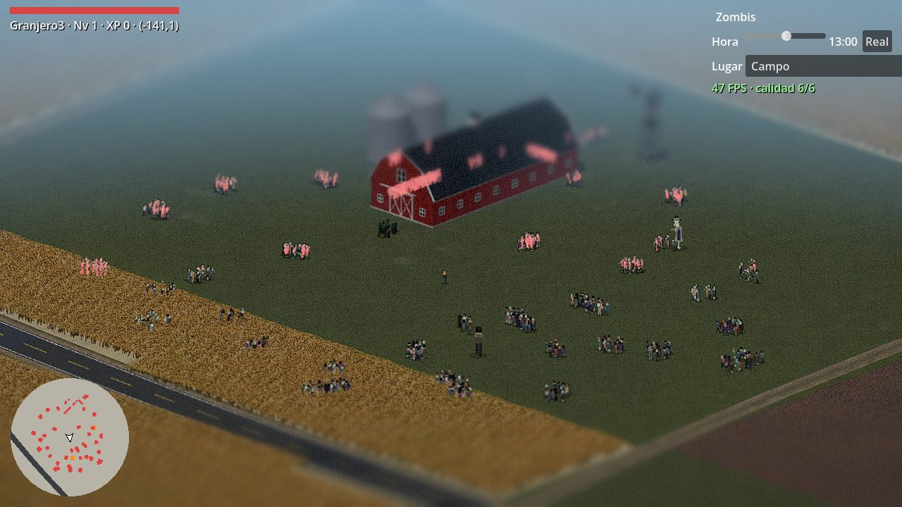
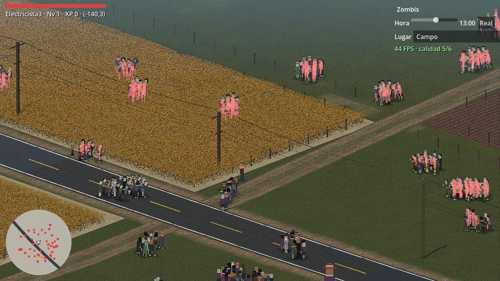
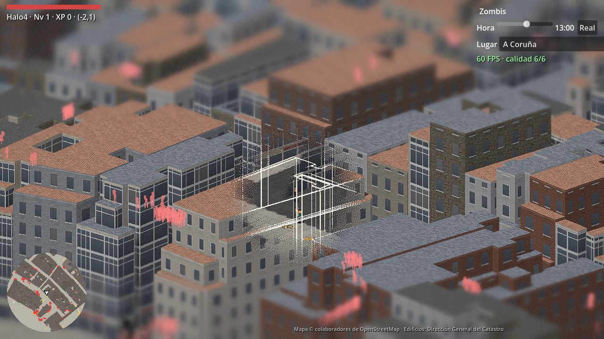

# Everlinth

Roguelike multijugador persistente de zombis en vista isométrica, sobre una ciudad
real: **A Coruña**, reconstruida con datos abiertos (OpenStreetMap, Catastro y relieve),
rodeada de **ciudades que se generan solas** y de un **campo** con granjas y trigales.

El mundo es compartido y persistente: lo que se derrumba se queda derrumbado, y un
personaje muerto se pierde para siempre.



| | |
|---|---|
|  |  |
|  |  |
|  |  |

## Qué hay en el juego

- **A Coruña real.** El juego incluye:
  - **Datos reales:** calles de OpenStreetMap y las 48.465 partes de edificio del Catastro, con su planta y su número de plantas. El relieve también es real, y el terreno sube y baja bajo calles, edificios y personajes.
  - **Costa:** paseo marítimo con muro de sillería ("coraza"), escollera, playas en desnivel y mar con oleaje, espuma y rompientes.
  - **Edificios singulares:** Estadio de Riazor, Palacio de los Deportes y Torre de Hércules a su altura real.
- **Ciudades generadas.** Fuera de A Coruña, la ciudad se genera sola: calles curvas, rascacielos, autovías elevadas con enlaces en trébol y tráfico. También hay controles con barreras New Jersey, obras y restos por las aceras.
- **Campo.** Carreteras secundarias con tendido eléctrico y telefónico, y farolas que se encienden de noche. Hay pistas de tierra y fincas con trigo en 3D que se mece, rastrojo con rodadas, tierra arada y prado, además de vallas y granjas (granero, silos, molino, tractor y casa de labranza).
- **Horda y población.**
  - **Zombis:** hordas de cientos que se reparten en manadas y cazan.
  - **Paseantes:** entran en pánico, tropiezan, se ayudan a levantarse y se contagian.
  - **Tráfico:** con policía, bomberos y ambulancias; respeta semáforos y STOP.
- **Combate y destrucción.**
  - **Ametralladora:** trazadoras, rebotes y fogonazos.
  - **Coches destructibles:** pierden ruedas y explotan.
  - **Edificios:** se derrumban con explosiones.
  - **Árboles:** se parten a balazos.
- **Halo de visión.** Lo que se interpone entre la cámara y el personaje se abre en un agujero con degradado, que deja ver el suelo alrededor de sus pies y la silueta del edificio.
- **Día y noche** con ventanas encendidas, farolas y hora ajustable.
- **Desplegable "Lugar"** para viajar entre A Coruña, las ciudades generadas y el campo.

## Arquitectura en una línea

Un **servidor Node** (autoridad del mundo, generación, zombis, disparos, SQLite) y un
**cliente Godot 4** (render, entrada, HUD, audio) que hablan un **protocolo JSON por
WebSocket** definido en `shared/`. Un **gestor de assets web** (`/admin/assets`) mantiene
el catálogo que el juego recarga en caliente.

Detalle en [docs/ARQUITECTURA.md](docs/ARQUITECTURA.md).

```
everlinth/
├── shared/    tipos y constantes del protocolo (TypeScript)
├── server/    servidor Node: mundo, generadores (citygen/), SQLite, backoffice
├── godot/     cliente del juego (Godot 4.7): scripts/, shaders/, assets/, tools/
├── client/    cliente web antiguo (three.js) y gestor de assets web
├── tools/     datos (osm/: OSM, relieve, Catastro), protocolo Godot, exportación
└── docs/      documentación del proyecto
```

## Puesta en marcha

Requisitos: **Node 22+** y **Godot 4.7.2** (edición estándar).

```bash
npm install
npm run build              # shared + server + client
```

**Arrancar el servidor** (puerto 3000):

```bash
cd server
DEBUG_WEAPONS=1 node dist/index.js
```

`DEBUG_WEAPONS=1` activa la tecla G de explosiones y los viajes de prueba.

**Abrir el juego:**

```bash
godot --path godot
```

En Windows, `jugar.bat` arranca el servidor si no está en marcha y abre el cliente.

- **Backoffice del mundo:** http://localhost:3000/admin
- **Gestor de assets:** http://localhost:3000/admin/assets

## Controles

| Acción | Teclado y ratón | Mando |
|---|---|---|
| Moverse | WASD / flechas | Stick izquierdo |
| Apuntar | Ratón | Stick derecho |
| Disparar | Clic izquierdo | Gatillo derecho (RT) |
| Girar la cámara 90° | Q / R | — |
| Zombis sí/no | Z | — |
| FPS | F3 | — |
| Explosión de prueba | G (con `DEBUG_WEAPONS=1`) | — |

La hora del día y el lugar se eligen arriba a la derecha.

## Datos y licencias

| Fuente | Uso | Licencia |
|---|---|---|
| © colaboradores de OpenStreetMap | Calles, costa, playas, parques, nombres | ODbL |
| Dirección General del Catastro | Plantas y alturas de los edificios de A Coruña | CC BY 4.0 |
| AWS Terrain Tiles (SRTM, Copernicus EU-DEM) | Relieve | Abiertas (ver fuentes) |
| ambientCG | Texturas PBR (fachadas, asfalto, hormigón, costa, campo, árboles) | CC0 |
| Kenney | Modelos de ciudad y coches | CC0 |
| Poly Pizza | Autobús y bicicleta | CC BY 3.0 |

Detalle y cómo regenerar los datos en [docs/DATOS.md](docs/DATOS.md). El juego muestra
la atribución de OpenStreetMap y del Catastro en pantalla.

## Documentación

| Documento | Contenido |
|---|---|
| [docs/ARQUITECTURA.md](docs/ARQUITECTURA.md) | Componentes, flujo de datos, coordenadas, protocolo, módulos de render |
| [docs/DATOS.md](docs/DATOS.md) | Canalización de datos reales: OSM, relieve, Catastro; cómo regenerarlos |
| [docs/ASSETS.md](docs/ASSETS.md) | Catálogo, generadores de modelos en código, texturas |
| [docs/PRUEBAS.md](docs/PRUEBAS.md) | Cómo se verifica: capturas automáticas, medición de FPS, opciones de prueba |
| [docs/DECISIONES.md](docs/DECISIONES.md) | Decisiones de diseño importantes y por qué se tomaron |
| [docs/HISTORIA.md](docs/HISTORIA.md) | Evolución del proyecto por etapas |
| [docs/migracion-godot.md](docs/migracion-godot.md) | Plan y estado de la migración de three.js a Godot |
| [docs/reglas-calle.md](docs/reglas-calle.md) | Reglas de la calle (cruces, semáforos, mobiliario) |
| [godot/README.md](godot/README.md) | Cliente Godot: ejecución, opciones, exportación |
